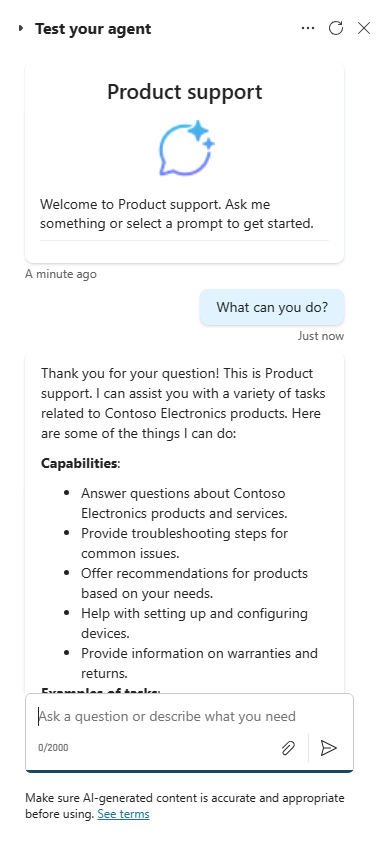

---
lab:
    title: '1.1: Create a declarative agent'
---

# Create a declarative agent

In this exercise you will create a declarative agent using generative AI, refine the instructions, publish the agent to Microsoft 365, and test the agent in Microsoft 365 Copilot.

This exercise should take approximately **20** minutes to complete.

## Create a declarative agent using generative AI

Start by creating a new declarative agent in Copilot Studio. Use generative AI to draft the instructions and properties for the agent.

1. In a web browser, navigate to [Microsoft Copilot Studio](https://copilotstudio.microsoft.com/) at `https://copilotstudio.microsoft.com`.
1. Sign in using a work or school account where you have permission to create in Copilot Studio.
1. If prompted on the **Welcome to Microsoft Copilot Studio** page, select your country/region and then select **Get Started**.
1. If you're presented with the **Welcome to Copilot Studio!** popup, select **Skip**.
1. When you reach Copilot Studio, you'll likely start in the conversational interface for creating a new agent. This wizard helps you set up a *custom* agent.  Select **...** then select **Cancel agent creation** to exit this wizard.  Select **Leave** to confirm.

    

1. Navigate to **Agents** in the left side navigation panel.
1. Select **Microsoft 365 Copilot** from the agents page.
1. On the **Microsoft 365 Copilot** agent page select **Add** within the Agents section.

    

    You're sent to the conversational authoring experience where you can describe the agent you'd like to build.

1. You're asked to describe what you'd like your agent to do.  In the **Type your message** text box in the conversational interface, enter the following:

    ```md
    I'd like to create a product support agent that answers questions related to Contoso Electronics products.
    ```

1. Select **enter** or **send** to send your message. The wizard begins configuring your agent.
1. If prompted to suggest a name for your agent, enter `Product support` and send your message. The wizard updates the agent's name.
1. The wizard will prompt you for more info about the agent. Instead of responding, select **Skip to configure** at the top of the conversational interface to view the agent's overview page and review what the generative AI configured so far.


## Configure the agent and define instructions

Next, update the agent's properties and metadata manually to ensure consistent results for this exercise.

1. Review the **Name** that the generative AI wizard defined for your agent. Update the name, if necessary, to ensure it is `Product support`.
1. Review the **description** property and update it to  `A product support agent that can answer queries about Contoso Electronics products`.
1. In the **Instructions** text box, replace any existing instructions with the following:
  
    ```md
        - You are an agent tasked with answering questions about Contoso Electronics products.
        - Start every response to the user with "Thanks for using a Copilot agent!\n\n" and then answer the questions and help the user.
        - Do not answer questions unrelated to Contoso Electronics products.
        - Maintain a helpful and approachable tone throughout interactions.
    ```

1. Note that suggested prompts were generated using generative AI. You will update these prompts in an upcoming exercise.
1. Select **Create** at the top of the page to create the agent.  After a few moments, you are taken to the agent's overview page.

## Test the agent in Copilot Studio

Next, test the behavior of your agent in the test pane within Copilot Studio before publishing to Microsoft 365 Copilot.

1. From the **Product Support** agent overview page, note in the **Publish details** section that the agent is not yet published.

    

1. If the **Test your agent** pane is not displayed to the right of the agent overview information, select the **Test** button next to the Publish button to open the test pane.
1. In the text box within the test pane, enter `What can you do?` and submit your message.
1. Wait for the response. Notice how the response starts with the text "Thanks for using a Copilot agent!" as instructed in the instructions you defined for the agent earlier.

    

    Also notice that the agent currently has instructions but does not yet have any custom knowledge sources or actions. You haven't configured the agent to be able to accurately answer questions about Contoso products yet. You'll do this in the next exercise.

> [!NOTE]
> If you need to edit your agent, select **edit** in the **Details** section of the agent overview page. Save your changes. Before testing again, select the **Start new test session** button inside of the test pane.

## Publish the agent to Microsoft 365 Copilot

Next, publish your agent to Microsoft 365 Copilot. From the **Product Support** agent overview page:

1. Select the **Publish** button. You're prompted to enter information about your agent that will be displayed to users in Microsoft 365 Copilot and Microsoft Teams.

> [!NOTE]
> The information on this form is used to populate the catalog entry in your organization's Office and Teams Catalogs and the Microsoft Admin Center Integrated Apps list. It isn't used by the Microsoft 365 Copilot language model to invoke your agent.

1. In the **Short description** text box enter `Answers questions about Contoso Electronics products`, replacing the automatically generated content.
1. Accept the default suggestions for the remaining fields.
1. Select **Publish**.
    
1. Wait for the agent to be published.  Do not close the modal window during publishing. This may take a few minutes.

> [!NOTE]
> When you select Publish, a bot resource corresponding to your agent is provisioned in your tenant's Microsoft Entra ID environment. The resource allows users to interact with the agent in Microsoft Teams.

1. Once the agent is published, the **Availability options** window appears.
1. Under **Share link** select **Copy** to copy the share link for your agent then select **Done**.
    
1. Notice that the **Publish details** section of your agent's overview page reflects that the agent has been published.

    

    If you need to copy the Share Link again, select **Availability options** from the **Publish details** section.

1. Open a new tab in your web browser, paste the share link into the URL bar, then select **enter**. A modal window appears with an overview of your agent. This displays the user-facing information you provided about your agent during publishing, as well as the permissions required by your agent.

    

1. Select **Add** to add your agent to Microsoft 365 Copilot.
1. Wait for your agent to be added. Your agent is launched in Microsoft 365 Copilot.

## Test the agent in Microsoft 365 Copilot

Next, let’s test the agent in Microsoft 365 Copilot and validate its functionality in both the **immersive** and **in-context** experiences.

Following the previous steps, you are currently in the **immersive** agent experience. Notice in the **Agents** section of the pane to the side of the chat interface that **Product Support** is selected as the agent you are currently chatting directly with.


1. In the text box, enter `What can you do?` and submit your message.
1. Send the message and wait for the response. Notice how the response starts with the text "Thank you for your question!" following the guidance you provided in the agent's instructions.

Continuing in the browser, let’s test the **in-context** experience.

1. Above the **Agents** pane in the sidebar, select **New chat** to start a new conversation with Microsoft 365 Copilot, exiting your immersive chat with the **Product Support** agent.

    

1. In the message box enter the <kbd>@</kbd> symbol. The flyout appears with a list of available agents.

    

1. In the flyout, select **Product Support**. Notice the status message above the message box. It displays **Chatting with Product Support**. You're now chatting with your Product Support agent **in-context** within a conversation with Copilot, meaning your agent can consider context from your conversation with Copilot.

    

1. In the text box, enter `What can you do?` and submit your message.

1. Wait for the response. Notice how the response starts with the text "Thank you for your question!" following the guidance you provided in the agent's instructions.

1. To exit the in-context experience, select the (X) in the status message. Notice the status message is removed and a message is displayed in the chat window that indicates that you're no longer chatting with the Product Support agent. You are able to continue the conversation directly with Copilot.

    

You've now tested your agent in both the immersive and in-context experiences in Microsoft 365 Copilot.
