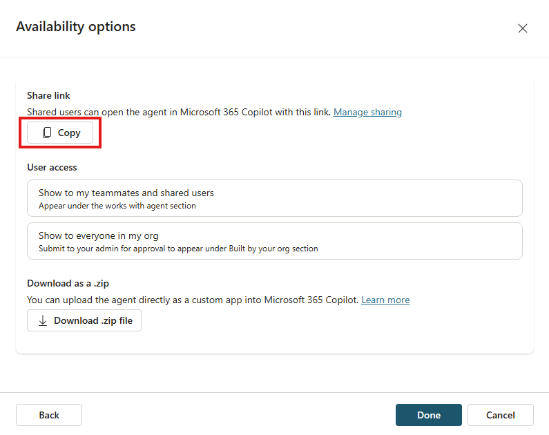
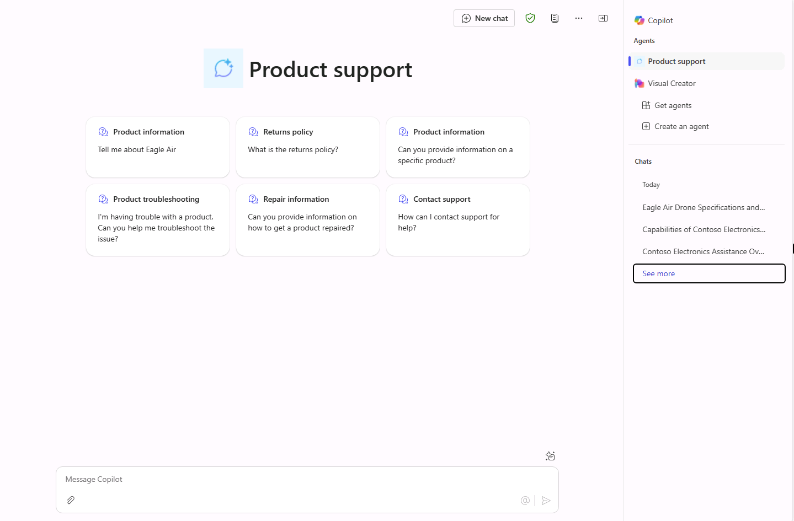

---
lab:
  title: '1.3: Add suggested prompts'
  description: In this exercise, you will update the declarative agent you created in the previous exercise with six appropriate suggested prompts.
  duration: 10 minutes
  level: 200
  islab: true
---

# Add suggested prompts

In this exercise, you will update the declarative agent you created in the previous exercise with six appropriate suggested prompts.

This exercise should take approximately **10** minutes to complete.

## Define suggested prompts

In Copilot Studio:

1. Navigate to your **Product Support** agent's **Overview** page.
1. Note that the conversational agent creation wizard may generate suggested prompts for your agent during creation. If it does, you can replace these with more appropriate prompts based on the agent's capabilities.
1. In the **Suggested Prompts** section, select the **Edit** icon or the **Add suggested prompts** button, depending on whether or not prompts were generated during agent creation.
1. Replace the existing prompts with the following:

      `Eagle Air` : `Tell me about Eagle Air`

      `Return policy` : `What is the returns policy`              

      `Product information` : `Can you provide information on a specific product?` 

      `Product troubleshooting` : `I'm having trouble with a product. Can you help me troubleshoot the issue?` 

      `Repair information ` : `Can you provide information on how to get a product repaired?`
      
      `Contact support` : `How can I contact support for help?`

1. Select **Save** to save your changes. 

## Republish your agent

Let's publish the updated agent to Microsoft 365 Copilot.

1. After your agent's changes have been saved successfully, select **Publish** at the top-right of your agent's overview page in Copilot Studio.
1. On the modal window that opens, select **Publish**.
1. On the **Availability options** window that opens, select **Copy** under the **Share link** heading.

    
1. In a different tab of your web browser, **paste** your agent's share link and press **Enter**. A window appears describing the **Product Support** agent.
1. Wait a few moments while the changes are published to the Product Support agent.
1. When the update is complete, close the modal window If you're not taken to Microsoft 365 Copilot in your browser, select **Copilot** from the left-hand menu or the **Apps** menu in the Microsoft 365 portal.

## Test your agent in Microsoft 365 Copilot

1. In the side panel in **Microsoft 365 Copilot**, find **Product Support** in the list of agents and select it to enter the immersive experience to chat directly with the agent. Notice that the suggested prompts you defined in Copilot Studio display in the user interface.

    

    > [!NOTE]
    > It can take several minutes for newly published suggested prompts to appear in Microsoft 365 Copilot. If you don't see them right away, wait a few minutes, then select **New chat** and reselect **Product Support**. The prompts display on a new, empty session.
1. **Select** a suggested prompt, **send** the message, and review the response.
