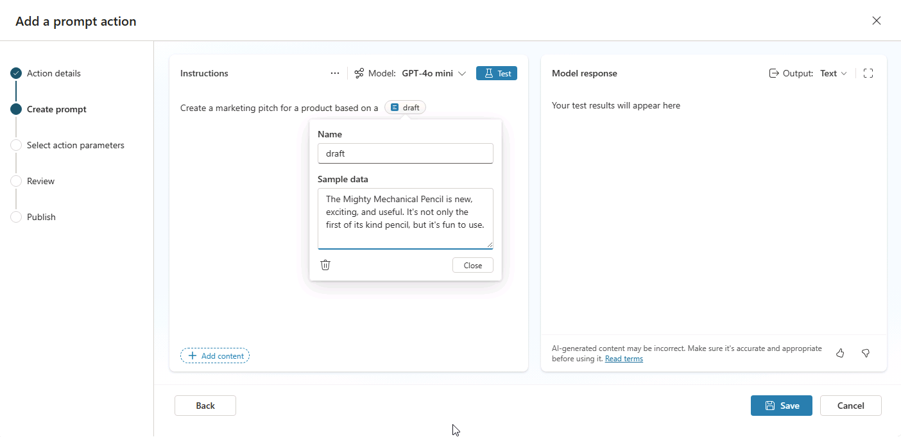

---
lab:
    title: '2.1: Create a prompt action'
---

# Create a prompt action

In this exercise you will create a prompt action, test the prompt in Copilot Studio, and test the prompt within a Copilot agent. You'll create a prompt action that helps users turn their raw ideas into organized marketing pitches that follow a specific format and guidelines.

This exercise should take approximately **15** minutes to complete.

## Create a custom prompt in Copilot Studio

1. Open Copilot Studio in your web browser by navigating to [Copilot Studio](https://copilotstudio.microsoft.com) at `https://copilotstudio.microsoft.com`.
1. Select **Tools** from the left hand navigation.
1. Select **Create new** then select **Prompt**. Your taken to the prompt builder UI.
1. In the **Instructions** text box, enter `Create a marketing pitch for a product based on a `.
1. Place your cursor at the end of the sentence you entered then select **Add content**
1. Select **Text**.
1. In the **Name** field, enter `draft`.
1.  In the **Sample data** field, enter `The Mighty Mechanical Pencil is new, exciting, and useful. It's not only the first of its kind pencil, but it's fun to use.` then select **Close**.

    

## Test and refine your prompt

1. Select **Test** above the instructions box to test the prompt with the sample data you provided.
1. View the output of the test run.

Let's refine the prompt to create more structured and consistent output.

1. In the **Instructions** textbox, add the following to the existing instructions to modify the prompt:

    ```The pitch should follow the following Contoso guidelines:
       - Start with a brief hook
       - Describe unique value proposition
       - End with a call-to-action
       - Use an exciting and influential tone
    ```

1. Select **Test** again to retest the prompt.
1. Notice how the response differs.
1. Select **Save**.

## Configure and publish your prompt

After saving your prompt, the **Configure for use in Agent** window appears.

1. In the **name** field, enter `Create a Contoso Marketing Pitch`.
1. In the **Description for the agent to know when to use this tool** field, enter `Create a marketing pitch that follows Contoso guidelines` then select **Next**. You're taken to the **Create prompt** page.
1. Select **Add**.

## (Optional) Add a prompt action to an agent

If you've completed the previous lab and created a declarative agent, you may add this action to your agent and update the agent's instructions to reference the action.

### Add the prompt tool

1. From the sidebar in Copilot Studio, select **Agents**.
1. Select **Microsoft 365 Copilot**.
1. Under **Agents**, select the **Product Support** agent you'd like to add the action to.
1. From the **Tools** section of the page, select **Add tool**.
1. Select the **Prompt** filter.
1. Select the **Create a Contoso Marketing Pitch** prompt.
1. Select **Add to agent**. The tool is now listed in the Product Support agent's **Tools**.

### Configure the prompt tool

1. From the **Tools** section of the agent's overview page, select the `Contoso Marketing Pitch` tool. You're taken to a page to configure the tool's properties and settings.
1. Select **Inputs** in the top navigation within the prompt tool.
1. Under **Additional inputs** select **Add**.
1. Select the **Draft** variable. A form appears.
1. Ensure the **How will the agent fill this input** field is set to **Dynamically fill with the best option (default)**.
1. In the **Display name** field, enter `Initial draft`.
1. Ensure the **Identify as** field is set to **User's entire response**
1. Select **Save** at the top right of the window.

### Update the agent's instructions

Update the agent's instructions to provide guidance for using the prompt.

1. In the **Instructions** text box, add the following to the existing instructions text: `Use the Contoso Marketing Pitch action to help marketing stakeholders craft pitches for products based on their draft ideas.`

## (Optional) Test your prompt tool in Copilot Studio

Next, test the agent with the prompt tool in Copilot Studio.

1. From the **Test your agent** pane in your agent's overview page in Copilot Studio, select the **refresh** button to refresh the test pane and load your agent's latest changes.
1. In the text box for the test conversation, enter `Create a Contoso marketing pitch based on the following draft: "Bouncy ball is the hottest product on the market for both youth and adults. It's durable and the largest of its kind."` then send the message.
1. Review the response and note that the agent is following the guidance you provided in the custom prompt's instructions.

You've completed the exercise and validated the functionality of your prompt tool.
